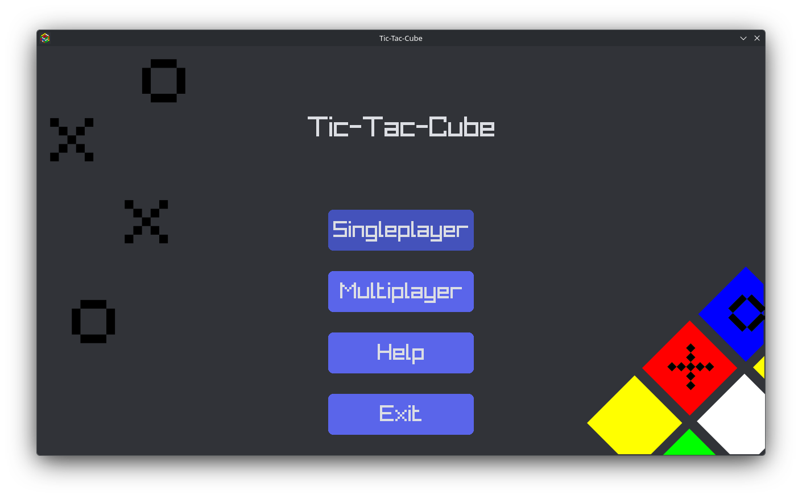

# Tic-Tac-Cube
A C++ game like Tic-Tac-Toe, except played on a Rubik's cube, and players can choose to turn a side or rotate the cube instead of making a turn.

## Download the game [here](https://ethancubes.itch.io/tic-tac-cube)

## Table of Contents
- [Quick Start](#quick-start)
- [Features](#features)
- [How to run locally](#how-to-run-locally)
- [How it works](#how-it-works)
- [AI Usage disclosure](#ai-usage-disclosure)
- [Credits](#credits)

## Quick Start
Download the game on Itch.io [here](https://ethancubes.itch.io/tic-tac-cube)
Watch a demo of the game [here]()

## Features
- All the features of regular tic-tac-toe
- Turn the cube to rearrange the X's and O's
- Rotate the cube to start fresh on a new board - unless the "new" board already have marks on it from previous rotations or turns
- Local multiplayer mode to play with your friends (or yourself) on the same device
- Singleplayer mode against a bot

## How to run locally
The game is currently a work in progress and the only way to play it is to build from source.
Just clone the Git repo, navigate to the root of the repo, and compile it.

## How to play
- Click the back button at the top left of the board anytime to return to the main menu.
### Singleplayer
- Click on the singleplayer button in the main menu.
- A popup will show up on the top right telling you who you are: x or o
- When it's your turn, make a move by clicking on the 3x3 board in the center, just like regular Tic-Tac-Toe, except....
- You can click on one of the buttons on the side to rotate the board!
- If you or the bot get a three-in-a-row on one single face of the board, the game ends. A popup will show up informing you about the victor, and you'll return to the main menu.
- When it's not your turn, the bot will play. It can turn the board and make moves just like you can.
- The bot is decently intelligent and will play to win and try to thwart your plans, but you should be able to beat it.

### Multiplayer
- Click on the multiplayer button in the main menu.
- You can move however you want, and play however you want, by clicking on the 3x3 board or on one of the rotation buttons surrounding the board.
- You can even play with a friend, hence "multiplayer"
- If you get a three-in-a-row on one single face, the game ends, and you'll return to the main menu

## How it works
Each side of a 3-D 3x3x6 (row x column x face) array, acts like an individual tic-tac-toe game/board. Only the top face of the 3x3 cube can be interacted with by the user. Each turn, the player can choose to turn the cube instead of making a normal tic-tac-toe move. 3x3x6 is used to store every single "sticker" on the cube, a 3x3x3 array would not be sufficient.

The oldest version of C++ this program can be compiled on is C++ 11, since it does not have any features introduced in C++ 14 or later. This was not an intentional design choice and the program was originally intended to run on C++17. I just ended up writing more low-level code and never implemented any more new features.

The input handling and graphics of the game were made with [Raylib](https://www.raylib.com/), because it is simpler and has more and better documentation (my personal opinion, I might just suck at researching) than the other graphics library I was considering, SDL2.

All the buttons in the game, including the ones that make up the "board," are part of a class that I wrote (myself) specifically for this project. The button class depends heavily on the [Nlohmann-Json](https://json.nlohmann.me/) library for data storage, since maps, arrays, and vectors just aren't enough, and I'm not about to write a tuple declaration longer than the entire rest of the file. The class uses a JSON object as input, and can display a separate button state when a mouse is hovering over it.

Bot "AI" is entirely written by me using a relatively simple rule-based system. This is done instead of using Min-Maxing because I don't know how to use Min-Maxing. I also though this project wouldn't take this long.

This project does not use any external libraries except for Raylib and Nlohmann/Json. Most of the classes like buttons, logs, and the bot are hard enough, writing code for a graphic game renderer or a new file format would be a next level of pain and difficulty.

Also, btw, this is my first serious experience with C++, so Please don't judge me too harshly.

## AI Usage disclosure
AI was used for debugging and research. I never used it to tell me what code I should write, or to replace my own thinking.
The AI model that was primarily used was [DeepSeek](https://deepseek.com/).
I also used it to convert Hex codes into RGB but I think that's fine, although there probably are alternatives that aren't AI and work just fine.

## Credits
- [Mosh Hamedani's 1 hour C++ Course for beginners](https://youtu.be/ZzaPdXTrSb8/) helped, since this is one of my first C++ projects.
- [GeeksForGeeks](https://www.geeksforgeeks.org/) and [w3schools](https://www.w3school.org/) helped a lot with general C++ knowledge. If I were to included every single link on there, it would be probably be longer than the entire rest of the readme.
- This [website](https://chirag4862.hashnode.dev/getting-started-with-raylib-for-game-development-in-c/) helped with getting raylib to work (it's technically a C tutorial but like whatever)
- The cube rotation algorithms were partially copied from my previous project [CubeTrainer](https://github.com/EthanCubes/CubeTrainer/). Somehow I still managed to get one of the four quintessential moves (it was Z btw) wrong and spent like 2 hours trying to fix it.
- The [Wikiepdia Article on Tic-Tac-Toe](https://en.wikipedia.org/wiki/Tic-tac-toe/) was used to program the bot for singleplayer.
- The page on notation on [JPerm.net](https://www.jperm.net/3x3/moves/) helped with distinguishing between E and S moves. I've been cubing for 5 years and still can't tell them apart.
- The graphics of this project was made in [Raylib](https://www.raylib.com/). A lot of the information about Raylib came from the Raylib Cheatsheet and Raylib Examples, which can be found on the Raylib [website](https://www.raylib.com/).
- This project used the [Nlohmann Json](https://json.nlohmann.me/) to store data easier, since it's really annoying to use tuples and arrays and vectors are just not enough
- This project uses the [Noto Sans](https://fonts.google.com/noto/specimen/Noto+Sans) font.
- Originally made for [Hack Club Stardance](https://stardance.hackclub.com/), thanks for giving me an excuse to learn several new languages and gain a lot of coding experience.
