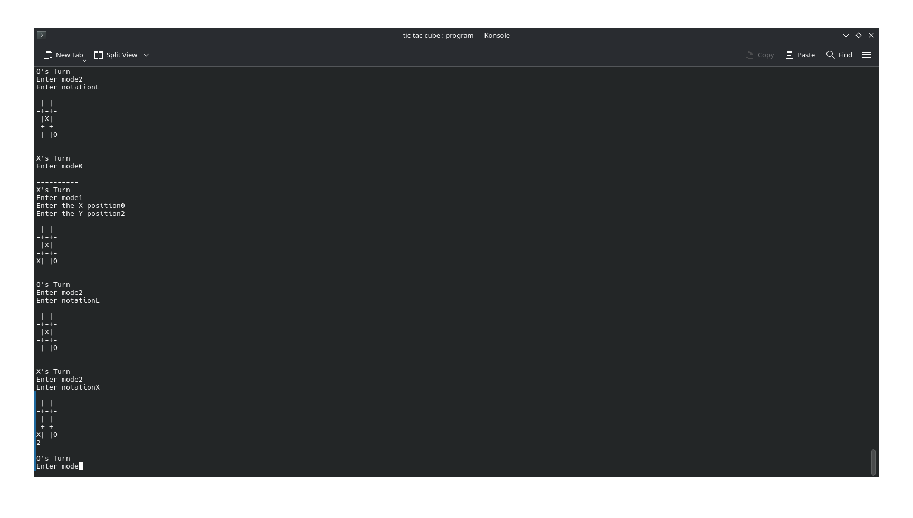

# Tic-Tac-Cube
A C++ game like Tic-Tic-Toe, except played on a Rubik's cube, and players can choose to turn a side or rotate the cube instead of making a turn.

## Download the game [here]()

## Table of Contents
- [Quick Start](#quick-start)
- [Features](#features)
- [How to run locally](#how-to-run-locally)
- [How it works](#how-it-works)
- [AI Usage disclosure](#ai-usage-disclosure)
- [Credits](#credits)

## Quick Start
Download the game from Itch.io [here]()
Or from GitHub [here]()

## Features
- Basic tic-tac-toe game
- Turn the cube to rearrange the x's and o's
- Rotate the cube to start fresh on a new board - unless the "new" board already have marks on it from previous rotations or turns

## How to run locally
I'm assuming this means running the source code instead of the precompiled binaries. If you do want the precompiled binaries, use the [Quick Start](#quick-start). This requires some basic terminal knowledge of commands such as "ls", "cd", etc.
1. Clone the git repo with `git clone https://github.com/EthanCubes/tic-tac-cube`
2. Enter the git repo and run `g++ -std=c++17 -lraylib -o build/tic-tac-cube src/main.cpp src/board.cpp`. This will compile the code to that your device can run it, and the binary will be located inside the build directory.
3. Run `build/tic-tac-cube` to run the program

## How it works
Each side of a 3x3 cube, represented by a 3-dimensional array, acts like a tic-tac-toe game (only the face that is currently at the top of the cube can be interacted with though). Each turn, instead of marking the top face with their corresponding mark, the player can choose to instead turn or rotate the cube. The GUI just accesses the text ui, and displays what the text UI shows in a graphical format.

## AI Usage disclosure
AI was used for debugging and learning. I never used it to tell me what code I should write, only asked it about like how I get a value from a tuple and things like that. 

## Credits
- [Mosh Hamedani's C++ Course]() helped  this is one of my first C++ projects, although a some of my previous knowledge from JavaScript carried over.
- [GeeksForGeeks](https://www.geeksforgeeks.org) and [w3schools](https://www.w3school.org/) helped a lot with general C++ knowledge. If I were to included every single link on there, it would be longer than the entire rest of the readme.
- This [website](https://chirag4862.hashnode.dev/getting-started-with-raylib-for-game-development-in-c) helped with getting raylib to work (it's technically a C tutorial but like whatever)
- The cube rotation algorithms were partially copied from my previous project [CubeTrainer](https://github.com/EthanCubes/CubeTrainer). Somehow I still managed to get one of the four quintessential moves wrong and spent like 2 hours trying to fix it.
- The GUI of this code was made in [Raylib](https://www.raylib.com/). A lot of the information about Raylib came from the Raylib Cheatsheet and Raylib Examples, which can be found on the Raylib website.
- This project was entirely coded with [Vim](https://www.vim.org). It's probably a better idea to use CLion or something, but I'm kinda addicted to using Vim now and will repeated bash the hjkl keys even in places that aren't Vim (like Discord or the devlog window in Stardance).
