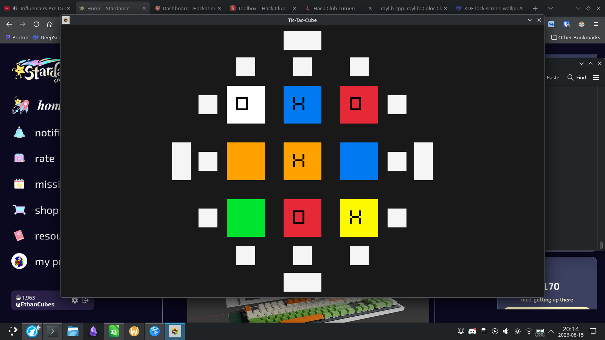

# Tic-Tac-Cube
A C++ game like Tic-Tic-Toe, except played on a Rubik's cube, and players can choose to turn a side or rotate the cube instead of making a turn.

## Download the game [here]()

## Table of Contents
- [Quick Start](#quick-start)
- [Features](#features)
- [How to run locally](#how-to-run-locally)
- [How it works](#how-it-works)
- [AI Usage disclosure](#ai-usage-disclosure)
- [Credits](#credits)

## Quick Start
Play the game on Itch.io [here]()
Download from GitHub [here]()

## Features
- Basic tic-tac-toe game
- Turn the cube to rearrange the x's and o's
- Rotate the cube to start fresh on a new board - unless the "new" board already have marks on it from previous rotations or turns
- Local multiplayer and singleplayer modes.

## How to run locally
(WIP)

## How it works
Each side of a 3x3, represented by a 3x3x6 (3D) array, acts like an individual tic-tac-toe game/board. Only the top face of the cube can be interacted with by the user. Each turn, the player can choose to turn the cube instead of making a normal tic-tac-toe move.

The oldest version of C++ this program can be compiled on is C++ 11, since it does not any features in C++ 14 or later.

The input handling and graphics of the game were made with [Raylib](https://www.raylib.com/), because it is simpler and has more and better documentation than the other graphics library I was considering, SDL2.

## AI Usage disclosure
AI was used for debugging and learning. I never used it to tell me what code I should write.
The AI model that was primarily used was [DeepSeek](https://deepseek.com/)

## Credits
- [Mosh Hamedani's 1 hour C++ Course for beginners](https://youtu.be/ZzaPdXTrSb8?si=CYgl26UYITcE1fpU) helped, since this is one of my first C++ projects.
- [GeeksForGeeks](https://www.geeksforgeeks.org) and [w3schools](https://www.w3school.org/) helped a lot with general C++ knowledge. If I were to included every single link on there, it would be longer than the entire rest of the readme.
- This [website](https://chirag4862.hashnode.dev/getting-started-with-raylib-for-game-development-in-c) helped with getting raylib to work (it's technically a C tutorial but like whatever)
- The cube rotation algorithms were partially copied from my previous project [CubeTrainer](https://github.com/EthanCubes/CubeTrainer). Somehow I still managed to get one of the four quintessential moves (it was Z btw) wrong and spent like 2 hours trying to fix it.
- The [Wikiepdia Article on Tic-Tac-Toe](https://en.wikipedia.org/wiki/Tic-tac-toe) was used to program the bot for singleplayer.
- The page on notation on [JPerm.net](https://www.jperm.net/3x3/moves/) helped with distinguishing between E and S moves. I've been cubing for 5 years and still can't tell them apart.
- The graphics of this project was made in [Raylib](https://www.raylib.com/). A lot of the information about Raylib came from the Raylib Cheatsheet and Raylib Examples, which can be found on the Raylib [website](https://www.raylib.com/).
- This project was coded with [Vim](https://www.vim.org) and [NeoVim](https://neovim.io/). Highly recommend at trying.
- This project was originally compiled with [GCC](https://gcc.gnu.org/) on [Arch Linux](https://archlinux.org/).
