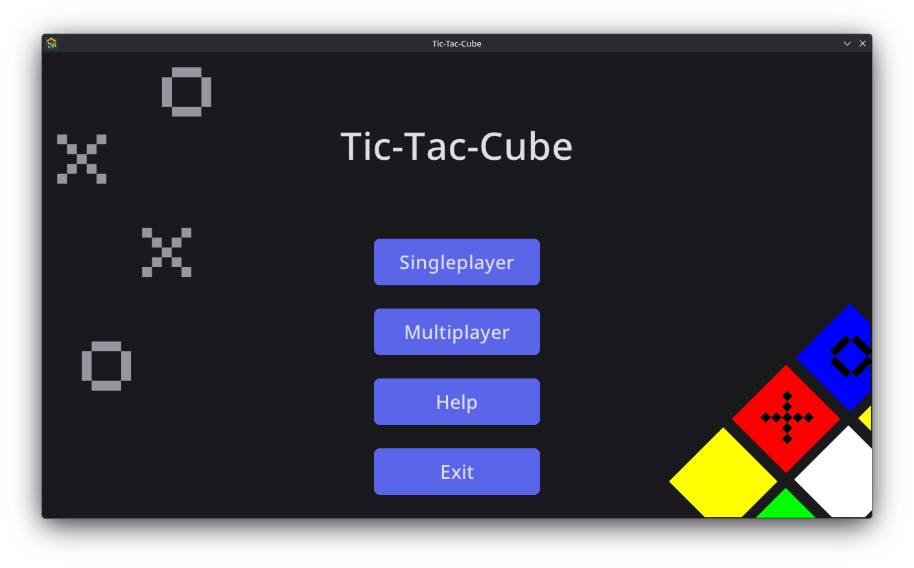

# Tic-Tac-Cube
A C++ game like Tic-Tac-Toe, except played on a Rubik's cube, and players can choose to turn a side or rotate the cube instead of making a turn.

## Play the game [here](https://ethancubes.itch.io/tic-tac-cube)

## Table of Contents
- [Quick Start](#quick-start)
- [Features](#features)
- [How to run locally](#how-to-run-locally)
- [How to play](#how-to-play)
- [How it works](#how-it-works)
- [AI Usage disclosure](#ai-usage-disclosure)
- [Credits](#credits)

## Quick Start
Play the game on Itch.io [here](https://ethancubes.itch.io/tic-tac-cube)

## Features
- All the features of regular tic-tac-toe
- Turn the cube to rearrange the X's and O's
- Rotate the cube to start fresh on a new board - unless the "new" board already have marks on it from previous rotations or turns
- Local multiplayer mode to play with your friends (or yourself) on the same device
- Singleplayer mode against a bot

## How to run locally
Clone the repo and compile the program. You will need to install raylib for this to work. On Linux and MacOS, you just install Raylib from your package manager (eg. Homebrew, pacman, apt, dnf). On Windows you can download Raylib from Itch.io. And then you'll need to compile the program, which is pretty complicated, but if you're trying to build from source locally you probably already know what to do.

## How to play
- Click the back button at the top left of the board anytime to return to the main menu.
### Singleplayer
- Click on the singleplayer button in the main menu.
- A popup will show up on the top right telling you who you are: x or o
- When it's your turn, make a move by clicking on the 3x3 board in the center, just like regular Tic-Tac-Toe, except....
- You can click on one of the buttons on the side to rotate the board!
- If you or the bot get a three-in-a-row on one single face of the board, the game ends. A popup will show up informing you about the victor, and you'll return to the main menu.
- When it's not your turn, the bot will play. It can turn the board and make moves just like you can.
- The bot is decently intelligent and will play to win and try to thwart your plans.
### Multiplayer
- Click on the multiplayer button in the main menu.
- You can move however you want, and play however you want, by clicking on the 3x3 board or on one of the rotation buttons surrounding the board.
- You can even play with a friend, hence "multiplayer"
- If you get a three-in-a-row on one single face, the game ends, and you'll return to the main menu
## Special Cases
- Due to the nature of a cube that allows it to turn, there is a chance that you may win or lose the game when the three-in-a-row isn't visible on your screen.

## How it works
- Each side of a 3-D 3x3x6 (row x column x face) array, acts like an individual tic-tac-toe game/board. Only the top face of the 3x3 cube can be interacted with by the user. Each turn, the player can choose to turn the cube instead of making a normal tic-tac-toe move. 3x3x6 is used to store every single "sticker" on the cube, a 3x3x3 array would not be sufficient for storing the state of each individual sticker, which the game relies on for winning logic and placement.
- The oldest version of C++ this program can be compiled on is C++ 17. There's one single function that doesn't work on C++ 14 or earlier, and while everything else works on C++ 11, I don't see a reason to rework my code since 90% of devs probably use C++ 17 anyway.
- The input handling and graphics of the game were made with Raylib, because it is simpler and has more and better documentation (my personal opinion, I might just suck at researching) than the other graphics library I was considering, SDL2. The project was compiled for WASM because it is incrediblely difficult to make an easy to demo a downloadable game with Raylib.
- All the buttons in the game, including the ones that make up the "board," are part of a class that I wrote (myself) specifically for this project. The button class depends heavily on the Nlohmann-Json library for data storage, since maps, arrays, and vectors just aren't enough, and I'm not about to write a tuple declaration longer than the entire rest of the file. The class uses a JSON object as input, and can display a separate button state when a mouse is hovering over it.
- Bot "AI" is entirely written by me using a relatively simple rule-based system. This is done because my computer is extremely low-end and any more complex algorithms willl probably melt it. I remember one instance where I did something wrong and my computer ended up crashing due to lag.
- This project does not use any external libraries except for Raylib and Nlohmann/Json. This is mainly because I was too lazy to find any other libraries.
- Also, btw, this is my first experience with C++, so please don't judge me too harshly.

## AI Usage disclosure
- AI was used for debugging and research. I never used it to tell me what code I should write, or to replace my own thinking.
- I also used it to convert Hex codes into RGB.

## Credits
- [Mosh Hamedani's 1 hour C++ Course for beginners](https://youtu.be/ZzaPdXTrSb8/) helped, since this is one of my first C++ projects.
- [GeeksForGeeks](https://www.geeksforgeeks.org/) and [w3schools](https://www.w3school.org/) helped a lot with general C++ knowledge. If I were to included every single link on there, it would be probably be longer than the entire rest of the readme.
- This [website](https://chirag4862.hashnode.dev/getting-started-with-raylib-for-game-development-in-c/) helped with getting raylib to work (it's technically a C tutorial but like whatever)
- The cube rotation algorithms were partially copied from my previous project [CubeTrainer](https://github.com/EthanCubes/CubeTrainer/). Somehow I still managed to get one of the four quintessential moves (it was Z btw) wrong and spent like 2 hours trying to fix it.
- The [Wikiepdia Article on Tic-Tac-Toe](https://en.wikipedia.org/wiki/Tic-tac-toe/) was used to program the bot for singleplayer.
- The page on notation on [JPerm.net](https://www.jperm.net/3x3/moves/) helped with distinguishing between E and S moves. I've been cubing for 5 years and still can't tell them apart.
- The graphics of this project was made in [Raylib](https://www.raylib.com/). A lot of the information about Raylib came from the Raylib Cheatsheet and Raylib Examples, which can be found on the Raylib [website](https://www.raylib.com/).
- This project used the [Nlohmann Json](https://json.nlohmann.me/) to store data easier, since it's really annoying to use tuples and arrays and vectors are just not enough
- This project uses the [Roboto Mono](https://fonts.google.com/specimen/Roboto+Mono) font.
- The theme of the project takes inspiration from [Monkeytype](https://monkeytype.com/)
- Originally made for [Hack Club Stardance](https://stardance.hackclub.com/), thanks for giving me an excuse to learn several new languages and gain a lot of coding experience (and also get some free stuff I guess).
